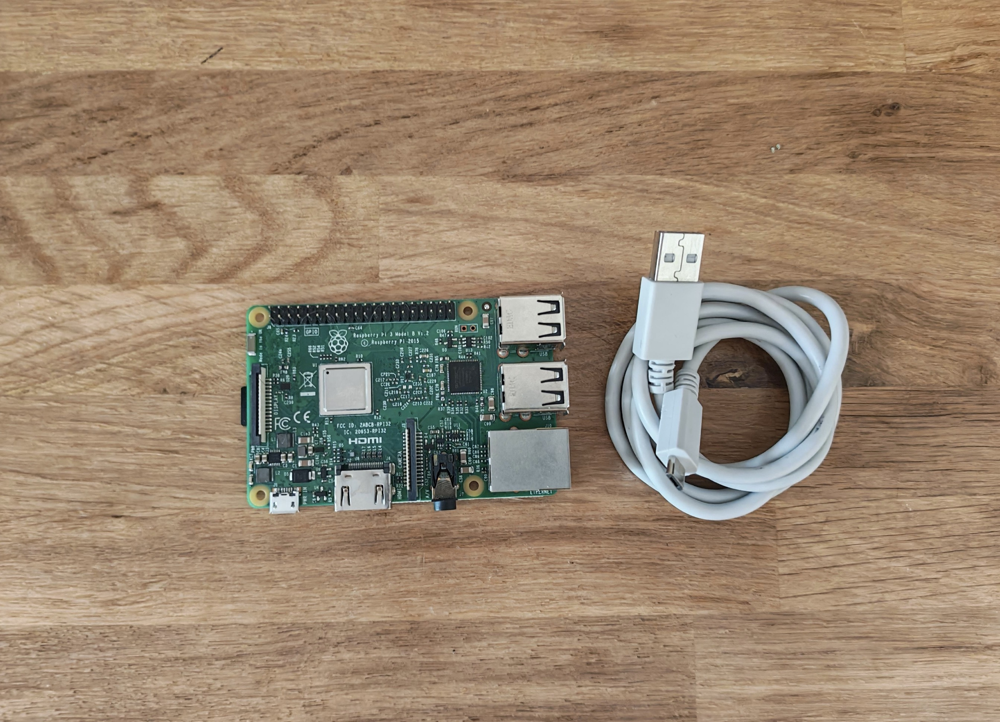
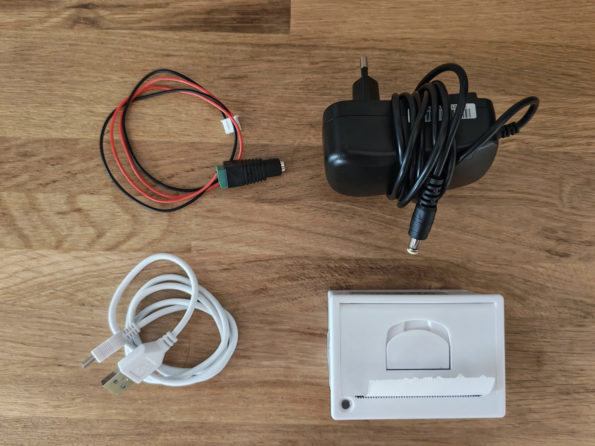

# SnapLab

SnapLab est un photomaton open-source réalisé avec du matériel low-tech à destination des tiers-lieux. L'objectif de SnapLab est de stimuler le lien entre les membres des différentes communautés qui composent ces tiers-lieux, en captant et partagant des moment.

Ce projet a pour vocation de donner un socle technique, que ce soit côté logiciel ou matériel, pour ensuite permettre aux personnes qui le souhaitent de mettre en place le photomaton de la façon la plus adaptée à leur lieux.

1. [Matériel](#matériel)
2. [Installation logicielle](#installation-logicielle)
3. [Comment contribuer](#comment-contribuer)

# Matériel

### [Raspberry Pi](https://www.raspberrypi.com/products/raspberry-pi-3-model-b/)

_Raspberry Pi avec son cable d'alimentation_

### [Mini imprimante thermique à tickets](https://www.manomano.fr/p/imprimante-thermique-integree-58mm-modele-micro-materiel-abs-support-usbttl-serie-alimentation-5-9v-210876678?from=my_orders)

_Imprimante thermique avec l'alimentation secteur 5V-9V (en noir), l'adaptateur (en rouge et noir), et le câble de USB de communication entre l'imprimante et le Raspberry_

### [Caméra](https://www.raspberrypi.com/products/camera-module-v2/)

_Camera avec sa nappe CSI_

### [TODO] => Bouton déclencheur

### [TODO] => Led

### Branchement

_Schéma des branchements_

# Installation logicielle

## Mise en route du Raspberry Pi

Pour configurer le Raspberry Pi, il faut utiliser [Raspberry Pi Imager](https://www.raspberrypi.com/software/) pour installer le système d'exploitation sur une carte micro SD.

# Comment contribuer
