# SnapLab

SnapLab est un photomaton open-source réalisé avec du matériel low-tech à destination des tiers-lieux. L'objectif de SnapLab est de stimuler le lien entre les membres des différentes communautés qui composent ces tiers-lieux, en captant et partagant des moment.

Ce projet a pour vocation de donner un socle technique, que ce soit côté logiciel ou matériel, pour ensuite permettre aux personnes qui le souhaitent de mettre en place le photomaton de la façon la plus adaptée à leur lieux.

1. [Matériel](#matériel)
2. [Configuration logicielle](#configuration-logicielle)
3. [Comment contribuer](#comment-contribuer)
4. [Sources](#sources)

# Matériel

### [Raspberry Pi](https://www.raspberrypi.com/products/raspberry-pi-3-model-b/)


_Raspberry Pi avec son cable d'alimentation_

### [Mini imprimante thermique à tickets](https://www.manomano.fr/p/imprimante-thermique-integree-58mm-modele-micro-materiel-abs-support-usbttl-serie-alimentation-5-9v-210876678?from=my_orders)


_Imprimante thermique avec l'alimentation secteur 5V-9V (en noir), l'adaptateur (en rouge et noir), et le câble de USB de communication entre l'imprimante et le Raspberry_

### [Caméra](https://www.raspberrypi.com/products/camera-module-v2/)

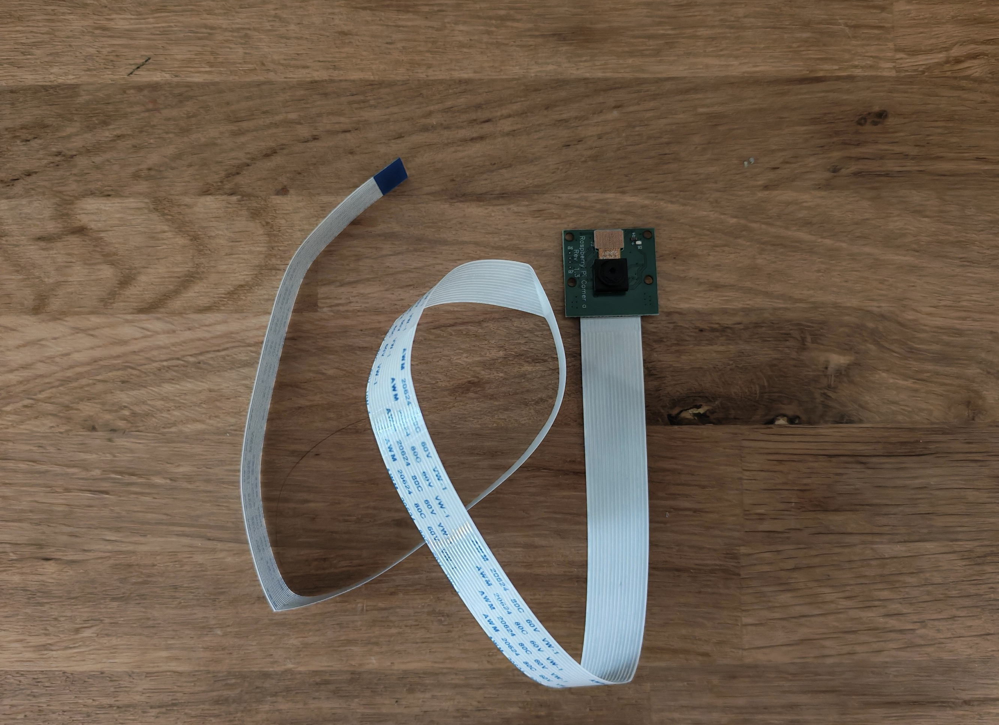
_Camera avec sa nappe CSI_

### [TODO] => Bouton déclencheur

### [TODO] => Led

### Branchement

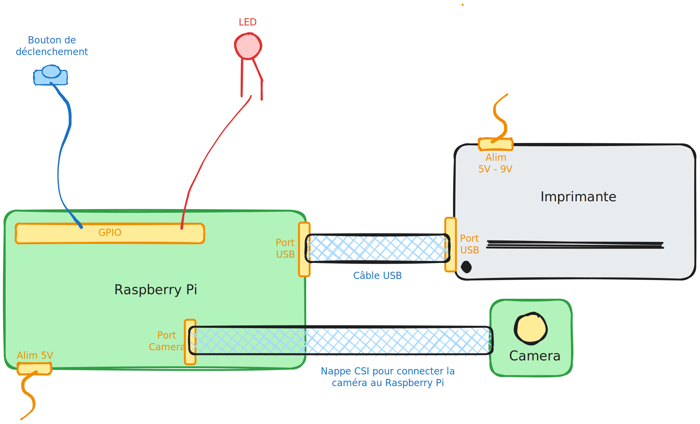
_Schéma des branchements_

# Configuration logicielle

## Mise en route du Raspberry Pi

### Installation du système d'exploitation

Pour configurer le Raspberry Pi, il faut utiliser [Raspberry Pi Imager](https://www.raspberrypi.com/software/) pour installer le système d'exploitation sur une carte micro SD.

Une fois le [Raspberry Pi Imager](https://www.raspberrypi.com/software/) lancé et la carte micro-sd inserée dans votre ordinateur, lancer la configuration.

1. Selection du modèle du Raspberry Pi
   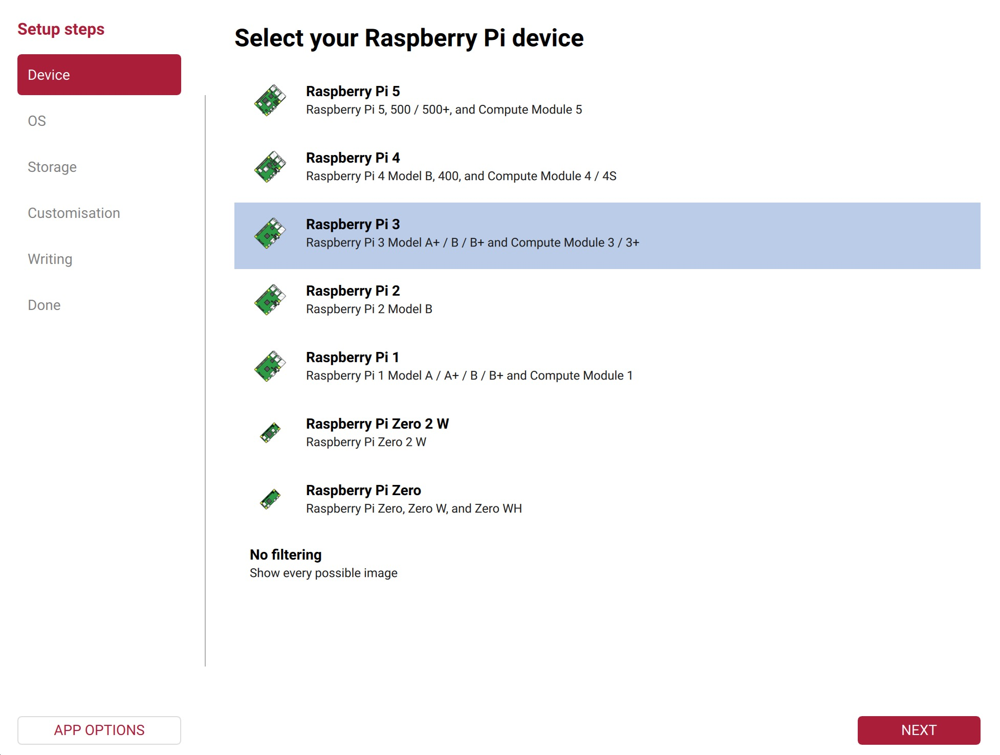

2. Selection du système d'exploitation à installer sur le Raspberry Pi
   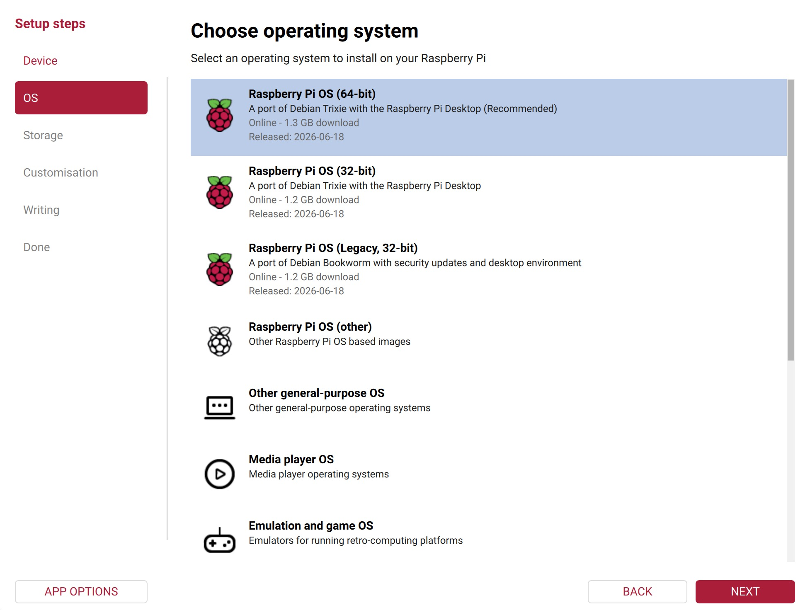

3. Selection de la carte micro SD qui va être insérée dans le Raspberry Pi
   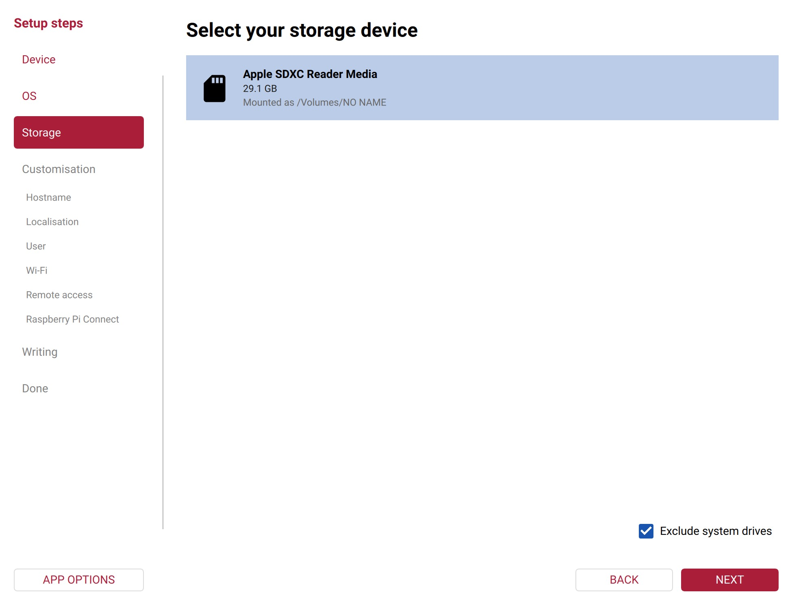

4. Customisation de session, avec le choix du nom d'utilisateur, mot de passe, etc.
   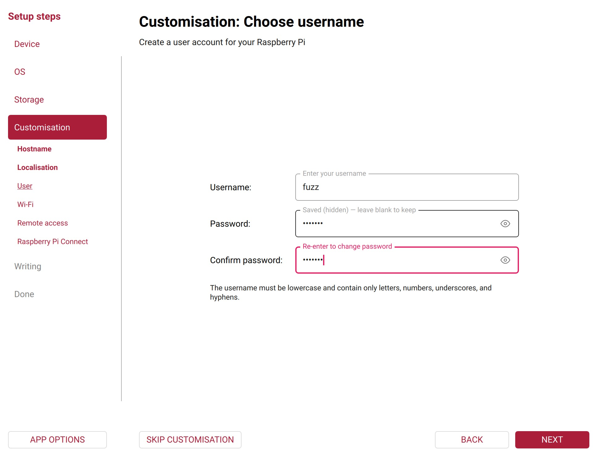

5. Création de l'image du système d'exploitation
   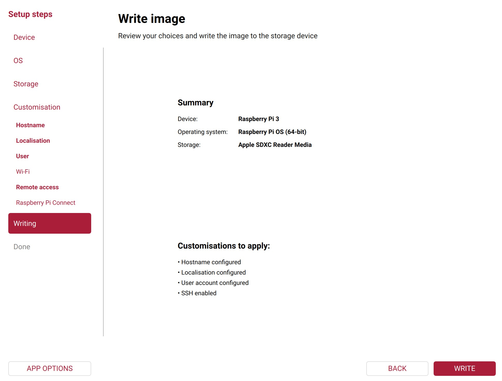
   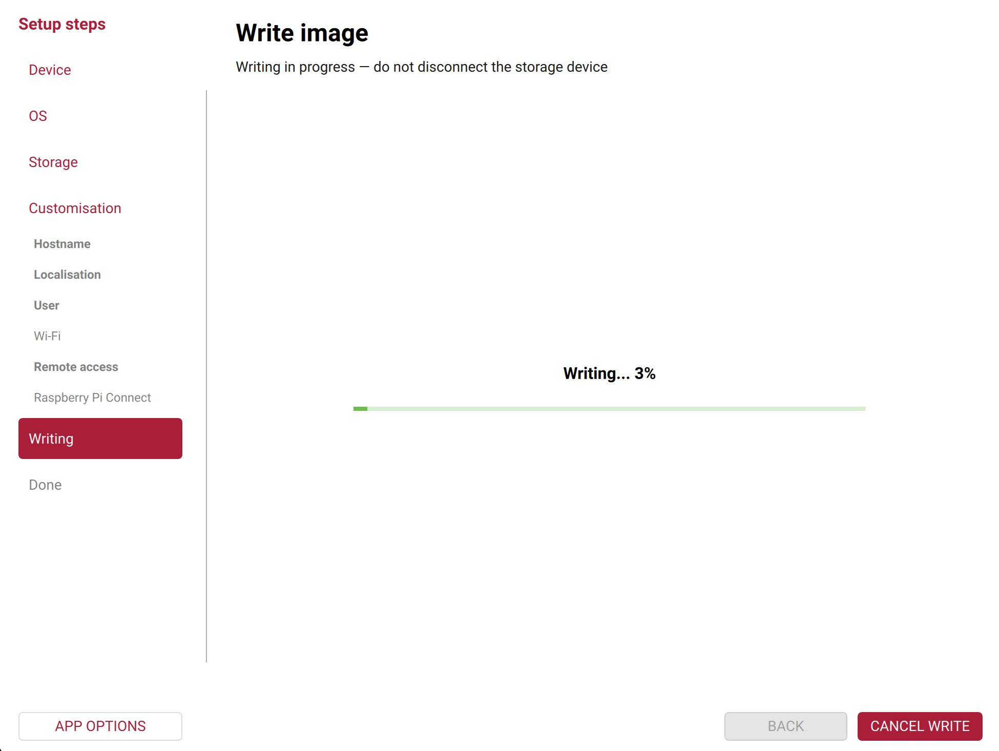

6. Une fois le processus terminé, éjecter la carte et micro SD, l'insérer dans le Raspberry Pi et mettre le Raspberry Pi sous tension. Lors du premier démarrage, la configuration se finalise, ce qui prend un peu de temps. Vous verrez quelques lignes de commandes s'exécuter, vous n'avez pas laisser faire et faire preuve d'un peu de patience.

### Fonctionnement de la caméra

Brancher la caméra dans le port prévu à cet effet.
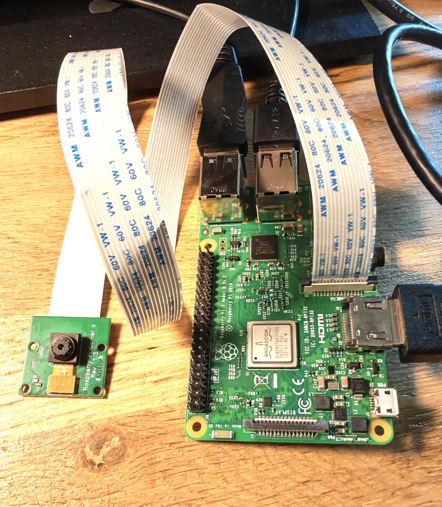

Pour s'assurer que la caméra fonctionne bien, ouvrir un terminal et exécuter la commande suivante:

```
rpicam-still -o test.jpg
```

Cette commande ordonne au Raspberry Pi de prendre une photo, et de la sauvegarder sous le nom `test.jpg`.

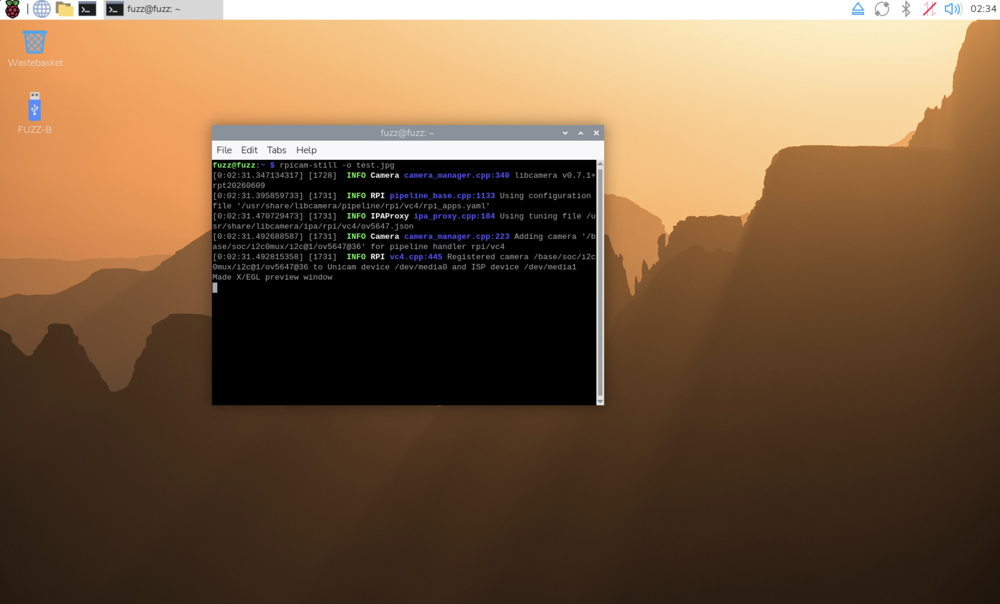
_Exécution de la commande_

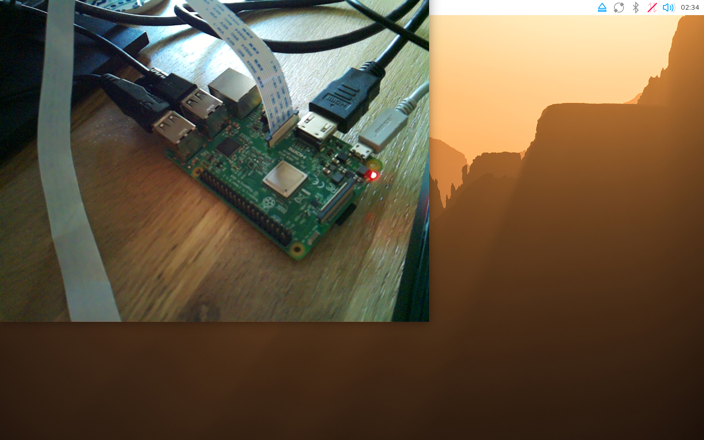
_La commande montre la vue de la caméra avant de prendre la photo_

### Configuration de l'imprimante

Pour faire fonctionner l'imprimante avec le Raspberry Pi, nous allons utiliser un protocole spécifique : le `CUPS`.

> CUPS — le Common Unix Printing System — est un système open source de gestion et de planification d'impression. L'un des aspects intéressants de CUPS est son système de filtres, capable de convertir les données d'un travail d'impression d'un format à un autre.

1. Désactiver les `serial-ports` et validez. Le Raspberry Pi va redémarrer pour effectuer les changements.
   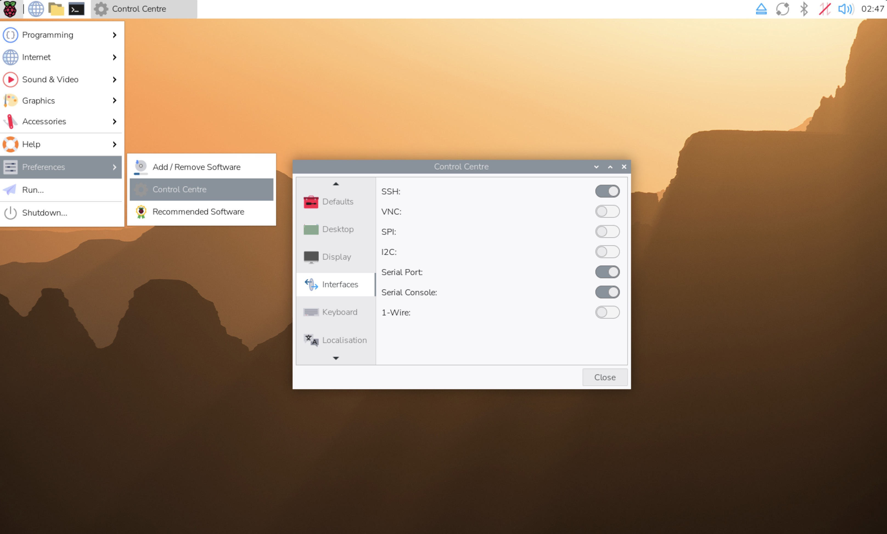

2. Mettre l'imprimante sous tension et la brancher au Raspberry Pi
   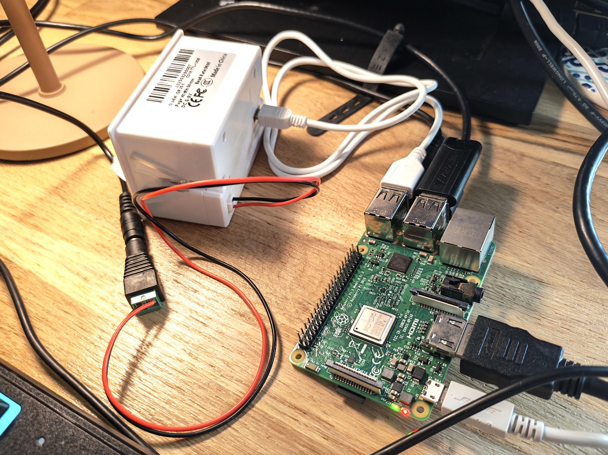

3. Tester si l'imprimante est bien reconnue avec la commande suivante

   ```
     ls -l /dev/usb/lp0
   ```

   Vous devriez voir quelque chose comme ceci apparaître :

   ```
   crwxrwxr-x 1 root lp 180, 0 Mar 14 14:11 /dev/usb/lp0
   ```

4. Tester si l'imprimante fonctionne correctement en imprimant un texte, exécutant les lignes de commande suivante :

   ```
    chmod 777 /dev/usb/lp0
    echo -e "Hello la communauté !" > /dev/usb/lp0
   ```

   

5. Installation des packages nécessaires à l'utilisation de l'imprimante. Attention, vous devez être connecté à internet pour cette étape. L'installation des packages peut prendre jusqu'à une quinzaine de minute

   ```
   sudo apt-get update
   sudo apt-get install libcups2-dev libcupsimage2-dev git build-essential cups system-config-printer
   ```

   ```
    git clone https://github.com/adafruit/zj-58
    cd zj-58
    make
    sudo ./install
   ```

# Comment contribuer

# Sources

- [https://cdn-learn.adafruit.com/downloads/pdf/networked-thermal-printer-using-cups-and-raspberry-pi.pdf](https://cdn-learn.adafruit.com/downloads/pdf/networked-thermal-printer-using-cups-and-raspberry-pi.pdf)
- [https://github.com/ryanlibs/T7-US-RS232-Thermal-Printer](https://github.com/ryanlibs/T7-US-RS232-Thermal-Printer)
- [https://www.youtube.com/watch?v=tD3J8CzDVlw](https://www.youtube.com/watch?v=tD3J8CzDVlw)
- [https://www.youtube.com/watch?v=J8LSlRTZ3_U](https://www.youtube.com/watch?v=J8LSlRTZ3_U)
- [https://raspberrytips.com/install-printer-raspberry-pi/#cups-installation](https://raspberrytips.com/install-printer-raspberry-pi/#cups-installation)
- [https://www.raspberrypi.com/documentation/computers/camera_software.html](https://www.raspberrypi.com/documentation/computers/camera_software.html)
